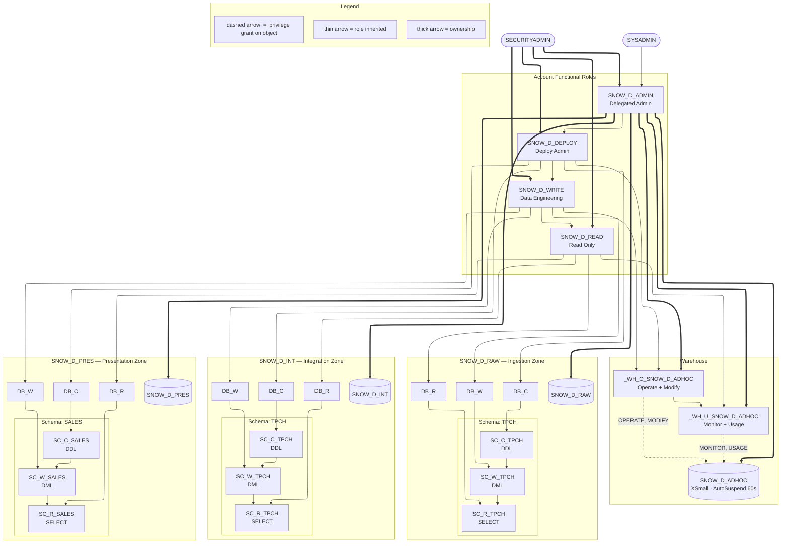

# Snowflake EDW — Role & Database Hierarchy

> **Legend**
> - Thin arrow `——▶` = role inherited (granted to parent)
> - Thick arrow `══▶` = ownership
> - Dashed arrow `- - ▶` = privilege grant on object

